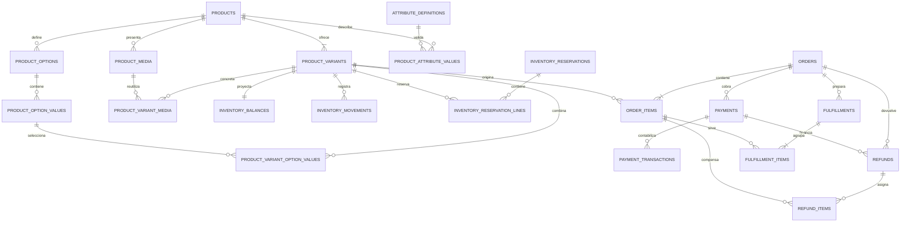

# Modelo transaccional objetivo de R2

> Diseño cerrado en R2.1: fija el destino, las invariantes, el orden de backfill
> y las puertas de R2.2–R2.14. R2.2 ya materializa producto-variante en la
> migración versionada `0007`; producción conserva `0001`–`0006` hasta superar
> la puerta separada de actualización/despliegue Astro.

## 1. Punto de partida y objetivo

El modelo actual representa correctamente el camino simple, pero concentra
responsabilidades que ya no pueden crecer juntas:

- `products` describe el artículo, lo vende, fija su precio y guarda su stock;
- `order_items` referencia solo al producto y congela nombre/precio;
- `orders.status` mezcla vida del pedido, pago y preparación;
- la pasarela cabe en dos columnas de `orders` y no existe un ledger de pagos;
- un único tracking en `orders` presupone un único envío total;
- cancelar un pedido pagado repone stock, pero no registra un reembolso del PSP.

R2 separa esas verdades sin cambiar de motor, proveedor ni arquitectura. El
producto describe; la variante se vende; inventario y pagos conservan
movimientos; fulfillment asigna cantidades de líneas; el pedido conserva sus
snapshots históricos.

## 2. ERD objetivo

El diagrama muestra las relaciones estables al cierre de R2. Las tablas de
opciones/media/atributos se activan por catálogo; reservas permanece apagada por
defecto. R3 añadirá la dimensión de ubicación al inventario, no antes.

## 3. Contratos por agregado

Los nombres son canónicos para el diseño. R2.2 convierte la parte
producto-variante en SQL exacto; los bloques de ledger harán lo mismo cuando
llegue su puerta de esquema. Ningún bloque puede reinterpretar estas
invariantes en silencio.

### 3.1 Catálogo y variante vendible

| Tabla | Responsabilidad y campos mínimos |
|---|---|
| `products` | Identidad editorial: `id`, `collection`, `slug`, `name`, `description`, marca, categoría, estado y timestamps. Conserva temporalmente `price_cents`, `stock`, `image` y capacidades de `0002` como espejos legacy. |
| `product_variants` | Unidad vendible: `id`, `product_id`, `sku`, `gtin`, `mpn`, `title`, `price_cents`, `compare_at_price_cents`, `status`, `is_default`, timestamps. `sku` es único sin distinguir mayúsculas; un producto simple tiene exactamente una variante por defecto. |
| `product_options` | Definición ordenada (`Talla`, `Color`) propiedad de un producto. Nombre único dentro del producto. |
| `product_option_values` | Valor ordenado de una opción. Valor único dentro de la opción. |
| `product_variant_option_values` | Combinación variante–valor. Una variante usa como máximo un valor de cada opción y una combinación no se repite. |
| `product_media` | Uso editorial de un asset: producto, ruta/clave, tipo, alt, foco X/Y y posición. No almacena binarios en D1. |
| `product_variant_media` | Asociación opcional de un media de su propio producto a una variante. |
| `attribute_definitions` | Código, etiqueta, tipo cerrado (`text`, `number`, `boolean`, `reference`, `list`), unidad y restricciones JSON validadas. |
| `product_attribute_values` | Un valor tipado por producto y definición; solo la columna correspondiente al tipo puede contener dato. |

Invariantes:

- la URL y el contenido pertenecen a `products`; SKU, precio y disponibilidad a
  `product_variants`;
- todo producto vendible tiene una variante activa por defecto; no se exige
  opción a un producto simple;
- `price_cents` y `compare_at_price_cents` son enteros; el segundo continúa
  siendo solo presentación y, si existe, es mayor que el primero;
- archivar no borra una entidad referenciada por pedidos, movimientos o media;
- un pedido nunca relee nombre, SKU ni precio vivo para reconstruir su pasado.

### 3.2 Pedido y snapshots

`orders` añade `currency` y separa gradualmente `payment_status` y
`fulfillment_status` del `status` legacy. `order_items` añade `variant_id`,
`sku_snapshot`, `product_name_snapshot` y `variant_name_snapshot`; conserva
`product_id`, `name_snapshot`, `unit_price_cents` y `qty` durante toda R2.

La variante puede archivarse después de la compra. Por eso los snapshots son la
fuente de presentación histórica y las FKs operativas pueden ser nullable con
`ON DELETE SET NULL`; borrar físicamente sigue siendo una operación excepcional,
no el flujo normal de catálogo.

### 3.3 Inventario

| Tabla | Responsabilidad y campos mínimos |
|---|---|
| `inventory_movements` | Ledger append-only: variante, delta distinto de cero, razón cerrada, actor, tipo/id de referencia, `idempotency_key` único, timestamp y correlación. |
| `inventory_balances` | Proyección por variante: `on_hand`, `reserved`, versión y timestamp. `available = on_hand - reserved`; nunca se acepta una cifra calculada por cliente. |
| `inventory_reservations` | Cabecera opcional con clave idempotente, estado (`active`, `released`, `consumed`, `expired`), propietario técnico y expiración. |
| `inventory_reservation_lines` | Cantidad positiva por reserva y variante; la pareja es única. |

Invariantes:

- `sum(inventory_movements.delta) = inventory_balances.on_hand`; la proyección
  puede reconstruirse y reconciliarse;
- no se edita ni borra un movimiento: una corrección es otro movimiento con
  razón y referencia;
- descontar stock exige disponibilidad suficiente en la misma unidad de trabajo;
  desaparece el `MAX(stock - qty, 0)`, que hoy oculta una sobreventa;
- evento de proveedor repetido, cancelación repetida o replay usa la misma clave
  idempotente y no crea un segundo movimiento;
- reservas está apagado por defecto; sin esa capacidad `reserved = 0` y no
  aparecen job, tabla operativa en panel ni configuración;
- R2 es inventario global por variante. R3.6 introducirá ubicación principal y
  backfill explícito; no se anticipa una interfaz multi-almacén vacía.

### 3.4 Pago y reembolso

| Tabla | Responsabilidad y campos mínimos |
|---|---|
| `payments` | Intención interna por pedido/proveedor: referencia del PSP, moneda, importe esperado y estado (`pending`, `authorized`, `captured`, `partially_refunded`, `refunded`, `failed`, `cancelled`, `requires_review`). |
| `payment_transactions` | Movimiento financiero inmutable: pago, tipo (`authorization`, `capture`, `refund`, `void`, `adjustment`), importe, moneda, estado, referencia PSP, clave idempotente, ocurrido/creado. |
| `refunds` | Workflow de devolución monetaria: pedido, pago, estado, razón, subtotal, envío y total en céntimos, referencia PSP y clave idempotente. |
| `refund_items` | Asignación a línea/cantidad con importe congelado y política de reposición separada. |

Invariantes:

- dinero siempre en céntimos enteros y moneda ISO de tres letras congelada;
- el importe sale del pedido/servidor, nunca del navegador ni del webhook sin
  contrastar;
- una referencia o clave idempotente del proveedor no puede materializar dos
  transacciones;
- capturado menos reembolsado nunca es negativo; un reembolso no supera el
  saldo capturado ni la cantidad reembolsable de cada línea;
- reembolsar dinero y reponer stock son decisiones relacionadas, no la misma
  operación: la política de reposición queda explícita y genera su movimiento;
- `orders.status` deja de ser contabilidad. El estado de pago se deriva del
  ledger y el de preparación de los fulfillments;
- la tarjeta sigue fuera de Logic2B: el modelo no guarda PAN, CVC, token de
  tarjeta ni respuesta cruda del PSP.

### 3.5 Fulfillment por líneas

| Tabla | Responsabilidad y campos mínimos |
|---|---|
| `fulfillments` | Grupo operativo por pedido: estado (`pending`, `ready`, `shipped`, `delivered`, `cancelled`), transportista, tracking, timestamps y clave idempotente. |
| `fulfillment_items` | Cantidad positiva de una línea asignada al grupo; pareja fulfillment–línea única. |

La suma preparada o enviada de una línea no puede superar su cantidad neta de
cancelaciones. Un tracking pertenece a un fulfillment, no al pedido. El estado
global es una proyección: todo enviado no equivale a parcialmente enviado, y un
reintento no crea un segundo grupo.

## 4. Compatibilidad durante R2

La migración sigue el patrón expand/contract. No se renombra ni elimina una
columna viva hasta R2.14 y nunca se obliga a desplegar esquema y binario en una
ventana inseparable.

| Contrato actual | Canon nuevo | Compatibilidad temporal |
|---|---|---|
| `products.price_cents` | variante por defecto | espejo de lectura/escritura hasta R2.14 |
| `products.stock` | balance/ledger de la variante por defecto | proyección legacy actualizada en la misma batch |
| `products.image` | primer `product_media` | fallback si aún no hay fila media |
| `order_items.product_id` | `order_items.variant_id` | ambos presentes; snapshots siguen válidos |
| `orders.stripe_*` | `payments` + `payment_transactions` | espejo del pago principal mientras haya lectores legacy |
| `orders.status` | estados de pedido/pago/fulfillment | proyección compatible, nunca fuente contable nueva |
| `orders.tracking_*` | primer/único fulfillment | espejo solo mientras el pedido tenga un envío total |

El rollback de binario consiste en volver a lectores legacy mientras todos los
espejos sigan al día. Después del corte canónico del ledger, cualquier rollback
que permita escrituras legacy requiere congelar mutaciones, reconciliar la
proyección y registrar una nueva apertura; no se puede alternar indefinidamente
entre dos fuentes de verdad.

## 5. Backfill determinista

Cada backfill genera un informe previo y usa claves estables. Una anomalía
detiene el bloque; no se corrige inventando datos.

### Producto-variante (R2.2)

1. Por cada `products.id`, crear una variante `is_default=1`.
2. Copiar precio, precio anterior y actividad; SKU temporal
   `LEGACY-{product_id}` si el seed/import no aporta uno.
3. Validar exactamente una variante, un default y mismo precio por producto.
4. No mover media, atributos ni stock todavía; permanecen en columnas legacy.

### Inventario (R2.7)

1. Crear balance de cada variante con el `products.stock` de su producto.
2. Crear un único movimiento `legacy_opening_balance`, incluso para cero si el
   contrato de apertura lo admite, con clave `r2:opening:{variant_id}`.
3. Comparar suma del ledger, balance y stock legacy antes de activar lecturas.
4. Desde el corte, decremento/restauración escriben movimiento, balance,
   outbox/audit y espejo legacy en una sola batch.

### Pago (R2.9)

1. Congelar `shopConfig.currency` en cada pedido histórico.
2. `pending` crea pago pendiente; `paid|shipped|delivered` crea captura por
   `orders.total_cents`; sesión `sim_*` usa proveedor `simulated` y el resto
   `stripe`/`legacy` según evidencia disponible.
3. Un `cancelled` que nunca pasó por `paid` no crea captura.
4. Un `cancelled` con evento previo `paid` se marca `requires_review`: el motor
   actual repone stock, pero no demuestra reembolso del PSP. R2 no fabrica una
   devolución monetaria ni una referencia externa.
5. Pedido pagado sin importe, moneda, sesión o evidencia coherente detiene el
   backfill y se resuelve antes del corte.

### Fulfillment (R2.11)

1. `shipped|delivered` crea un fulfillment con todas las cantidades del pedido.
2. Copiar transportista/tracking y el timestamp derivable del timeline.
3. Un pedido enviado sin tracking o con cantidades incoherentes detiene el
   backfill; `paid|pending|cancelled` no crea fulfillment ficticio.
4. Verificar por línea que preparado, reembolsado y cancelado nunca exceden `qty`.

Los reembolsos parten vacíos: el sistema actual no ejecuta una devolución en el
PSP y no existe dato histórico suficiente para backfillearla.

## 6. Seeds, importación y exportación

- El formato v1 de seed sigue aceptado: cada producto se transforma en una
  variante por defecto. El formato v2 añade `variants`, `options`, `media` y
  atributos, pero el generador valida que no se mezclen dos precios/stock
  contradictorios.
- Durante compatibilidad, el seed emite producto + variante y los espejos
  legacy en el mismo lote. Las fixtures de pedido resuelven `variant_id` por SKU
  o variante default y continúan congelando snapshots.
- La copia administrativa añade las nuevas tablas en orden de FK, pero mantiene
  fuera `audit_log`, `contact_requests` y datos operativos internos ya excluidos
  por seguridad. El formato de backup incorpora versión de esquema y aborta si
  se intenta restaurar sobre una versión incompatible.
- El export de catálogo v2 incluye productos, variantes, combinaciones,
  atributos y media. El CSV logístico continúa usando snapshots de pedido: no
  depende de que el producto o variante sigan publicados.

## 7. Plan de migración y puertas

| Bloque | Cambio autorizado tras su puerta | Criterio de corte/rollback |
|---|---|---|
| R2.2 | Tablas/columnas aditivas de producto-variante y backfill 1:1. Sin lector nuevo. | Recuentos, unicidad, FK y precios idénticos; rollback de binario trivial. |
| R2.3 | Dominio/repositorio canónico y lectura de variante. | Shadow-read sin diferencias; flag permite volver al lector legacy. |
| R2.4 | Admin, seed e import/export escriben producto-variante. | Doble escritura y fixtures restaurables; ninguna UI aparece si capacidad está apagada. |
| R2.5 | Media y atributos tipados; fallback a columnas de `products`. | Asociación solo dentro del producto; export v2 completo. |
| R2.6 | ADR/SQL exacto del ledger. | Nueva puerta de esquema; sin mutar stock todavía. |
| R2.7 | Movimiento, balance, backfill y escritura canónica. | Reconciliación a cero; rollback exige espejo legacy íntegro. |
| R2.8 | Reservas y job de expiración opcionales. | Carrera última unidad, expiración y replay idempotentes. |
| R2.9 | Ledger de pagos y backfill. | Saldos por pedido exactos; excepciones `requires_review` resueltas. |
| R2.10 | Reembolso total extremo a extremo. | PSP, ledger, evento, email y stock reintentables sin duplicado. |
| R2.11–R2.12 | Fulfillment total y luego parcial por cantidades. | Totales por línea y proyecciones de estado exactas. |
| R2.13 | Cancelación/reembolso parcial. | Property tests de redondeo, cantidades y concurrencia. |
| R2.14 | Contracción de espejos legacy, solo tras una versión completa estable. | Backup/restore v2, E2E y procedimiento de downgrade probado antes de eliminar. |

Cada migración aditiva necesita aprobación expresa, copia fresca, ensayo sobre
base aislada, `PRAGMA foreign_key_check`, invariantes de dominio y `pnpm check`.
No se aplica automáticamente por haber aceptado este diseño.

## 8. Ensayo de backup/restore de R2.1

El 2026-08-07 se ensayó la línea base local sin modificar la D1:

1. `wrangler d1 export ecom-demo --local --output <temp>/baseline.sql -y`;
2. restauración del SQL en una SQLite temporal nueva;
3. comparación de 12 tablas de aplicación, 18 índices y todos los recuentos;
4. `PRAGMA foreign_key_check` con 0 violaciones e `integrity_check = ok`.

La muestra contenía 194 productos, 8 pedidos, 13 líneas, 21 eventos, 16 emails,
4 tarifas, 6 migraciones y 1 ejecución de job; origen y copia coincidieron. El
fichero temporal ocupó 133.903 bytes. `_cf_METADATA` es metadata local de
Miniflare y no forma parte del export de aplicación, correctamente.

Antes de R2.2 se repitió con un export remoto fresco y se restauró en una base
aislada, nunca encima de producción; la evidencia queda en §10. Cada migración
posterior repetirá la misma operación y revalidará los comandos con el
`wrangler --help` instalado en su sesión.

## 9. Consultas de preflight obligatorias

El script de R2.2 convierte estas condiciones en pruebas, no las ejecuta como
correcciones:

- productos sin slug, precio/stock inválido o más de un catálogo inesperado;
- líneas cuyo `product_id` no existe o cuyos snapshots/qty son inválidos;
- pedidos cuyo total no coincide con subtotal + envío;
- pagados sin sesión/evidencia o cancelados después de un evento `paid`;
- enviados/entregados sin tracking o sin líneas;
- duplicados previstos de SKU, referencia PSP o clave idempotente;
- cualquier `foreign_key_check` o `integrity_check` no vacío.

Un resultado distinto de cero genera informe y bloquea el corte. No se borra,
redondea, reembolsa ni repone nada durante un backfill de estructura.

## 10. Evidencia de R2.2

El 2026-08-08 la puerta fue aprobada expresamente y se ejecutó contra un export
remoto fresco de 136.496 bytes. El script reproducible restauró las 12 tablas
legacy, aplicó `0007`, generó un dump de 132.000 bytes y lo restauró en una
segunda SQLite. Los 194 productos produjeron 194 variantes default; 8 pedidos y
13 líneas conservaron snapshots y referencia; los hashes de todas las columnas
legacy coincidieron antes, después y tras restore. `foreign_key_check` quedó en
cero e `integrity_check` en `ok`.

Wrangler aplicó la migración y el seed compatible en D1 local con 194/194 filas,
cero líneas incompletas y cero violaciones FK. Producción no se migró: el Worker
servido todavía contiene el cron anterior, que no reconstruye variantes, y la
actualización Astro ya estaba fijada como puerta independiente antes de otro
deploy. R2.2 queda cerrado en repo/local sin falsear el estado remoto.
